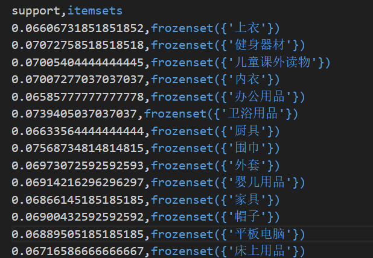

> Github仓库地址：https://github.com/Hongfei-x/Peer-Assessment-Assignment-2

# 结果展示与分析
>- 
>- 结果展示了不同商品类别频繁项集的支持度计数，反映了各类商品在交易中的出现频率。
>- 支持度数值相对接近，表明各类商品的购买频率较为均衡，其中“文具”“智能手表”“模型”等商品的支持度略高，可能是较受欢迎或有特定需求的商品类别。
>- 可帮助商家了解各类商品的受欢迎程度，从而优化商品库存和采购策略，对于高支持度的商品可适当增加库存，也可基于关联规则进行捆绑销售或促销活动。

>- 
>- 结果包含不同支付方式的频繁项集及其支持度，呈现了消费者对各种支付方式的使用频率，以及支付方式与商品类别之间的关联。
>- 传统支付方式如“现金”“微信支付”“支付宝”等支持度较高，且常见的支付方式与多种商品类别都有一定的关联组合，如“微信支付”与“智能手机”“文具”等常见商品的关联较多。
>- 商家可以根据不同支付方式的使用频率来优化收银流程，对于高频支付方式可提供更便捷的支持和服务；同时，利用支付方式与商品的关联进行针对性的营销推广，如在使用特定支付方式购买某类商品时提供优惠。

>- 
>- 记录了不同商品类别频繁退货项集的支持度，反映出哪些商品类别容易发生退货情况。
>- 支持度相对较低，说明整体退货率不算特别高，但某些商品组合如“围巾”和“卫浴用品”“围巾”和“文具”等存在一定的退货关联。
>- 商家可针对这些容易退货的商品类别和组合，加强商品质量检查和售后服务，提前向消费者提供更详细的商品信息，减少因信息不对称导致的退货，降低运营成本。

>- 
>- 列出了高价值支付方式及其对应的支付次数，可看出不同支付方式在高价值交易中的使用情况。
>- 各支付方式的支付次数相对接近，表明在高价值交易中，消费者对不同支付方式的选择较为分散，没有特别突出的偏好。
>- 商家在处理高价值交易时，需确保支持多种支付方式，以满足不同消费者的支付习惯，提高交易成功率；同时可与支付机构合作，针对高价值支付提供额外的安全保障或优惠措施。

>- 
>- 展示了2020年至2025年各个月份不同商品类别的销售数量，呈现了商品销售的月度变化趋势。
>- 各类商品在不同月份的销售数量存在波动，一些商品如“智能手机”“文具”等在某些月份销量较高，可能与季节因素、节假日等有关；此外，多数商品在各个月份的销售相对稳定，但也有一些商品在个别月份销量突增或下降明显。
>- 商家可以根据各商品的月度销售趋势进行季节性备货和促销安排，在销量高峰月份提前备足库存，加大营销力度；对于销量波动较大的商品，深入分析原因，如市场需求变化、竞争情况等，及时调整经营策略。

>- 
>- 按季度统计了不同商品类别的销售数量，便于观察商品销售的季度性规律。
>- 各类商品在不同季度的销售呈现出一定的规律性和差异性，例如有些商品在某个季度销量较高，可能是由于该季度的气候、节日、消费习惯等因素影响。
>- 有助于商家制定更具针对性的季度采购、销售和营销计划，根据商品的季度销售特点，合理分配资源，优化库存管理，提高资金使用效率，同时也为季节性商品的促销活动提供依据。

>- 
>- 记录了商品之间的购买序列关系及出现次数，反映了消费者购买商品时的先后顺序偏好。
>- 存在较多的商品序列组合，如“智能手机”后接“模型”“智能手机”后接“围巾”等序列出现次数较多，表明消费者在购买某些商品后，有较高的概率会接着购买另一类相关或互补的商品。
>- 商家可以基于这些序列关系进行商品的关联推荐和展示，在消费者购买某商品时，推荐与之相关的后续购买商品，提升消费者的购买体验和连带销售率，增加销售额。

>- 
>- 呈现了不同工作日（周一至周日）各商品类别的销售数量，有助于了解商品销售的日常波动情况。
>- 部分商品在周末或特定工作日的销量较高，可能与消费者的购物时间安排、工作日与周末的消费场景差异等因素相关；同时，多数商品在各工作日的销售也存在一定规律性。
>- 商家可根据各商品在不同工作日的销售特点，灵活调整人员排班、促销活动时间等运营安排，提高运营效率和服务质量；此外，针对周末销量较高的商品，可提前做好备货和库存管理。